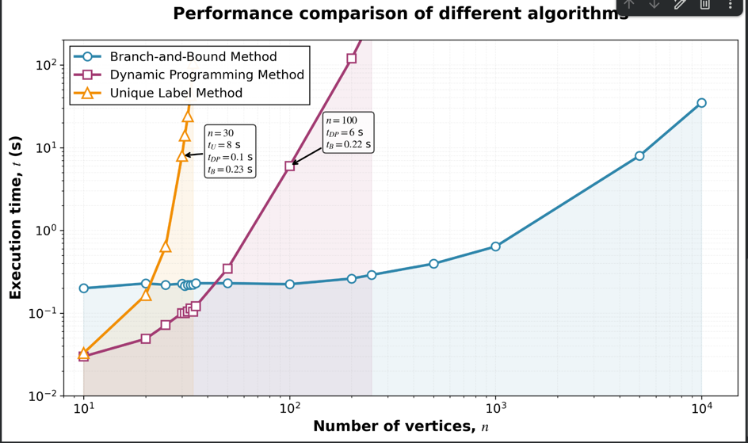

# Performance Comparison of Algorithms

The table below shows the time dependency of the tested algorithms on the number of vertices in the compared graphs.

# Performance Comparison of Four Algorithms

| Vertices | Branch Matching(s) | MCS Tree Search (s) | Backtracking (s) | Bruteforce (s) |
|----------|--------------------|---------------------|------------------|----------------|
| 9        | 0.200              | 0.030               | 0.030            | 2.000          |
| 10       | 0.200              | 0.030               | 0.033            | 20.000         |
| 11       | 0.200              | 0.030               | 0.033            | 99.000         |
| 20       | 0.229              | 0.049               | 0.166            | -              |
| 25       | 0.220              | 0.072               | 0.639            | -              |
| 30       | 0.227              | 0.100               | 8.000            | -              |
| 31       | 0.214              | 0.100               | 14.000           | -              |
| 32       | 0.219              | 0.105               | 24.000           | -              |
| 33       | 0.220              | 0.114               | 43.000           | -              |
| 34       | 0.221              | 0.104               | 105.000          | -              |
| 35       | 0.230              | 0.121               | -                | -              |
| 50       | 0.230              | 0.346               | -                | -              |
| 100      | 0.224              | 6.000               | -                | -              |
| 200      | 0.262              | 120.000             | -                | -              |
| 250      | 0.290              | 360.000             | -                | -              |
| 500      | 0.396              | -                   | -                | -              |
| 1000     | 0.639              | -                   | -                | -              |
| 5000     | 8.000              | -                   | -                | -              |

For a clearer visualization, the graph below is provided to better illustrate the time dependency.

