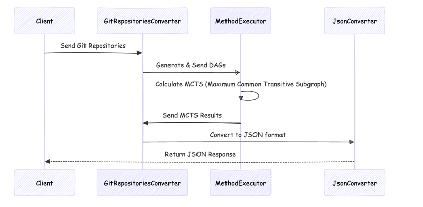

# Integration of MCTS Search Methods into a Tutorial for Teaching Students Git Repository Workflow

The tutorial will be a client-server application.

- After completing manipulations with the assigned repository, the student submits it for evaluation through the interface.
- The submitted repository and the expected repository (the target result) are converted into DAGs.
- The DAGs are passed to the **method executors**, which find the **Maximum Common Transitive Subgraph (MCTS)**. The MCTS format includes:
    - Mapping of vertices (commits) from one graph to vertices of the other.
    - Lists of missing and extra **hunks** (changes/diffs).
- The MCTS is transformed into a format suitable for **visualizing the differences between the two repositories**:
    - Vertices are replaced with commits.
    - Based on the MCTS, missing/extra commits and missing/extra hunks are identified.
- The resulting data is converted to **JSON** and sent back to the client.

